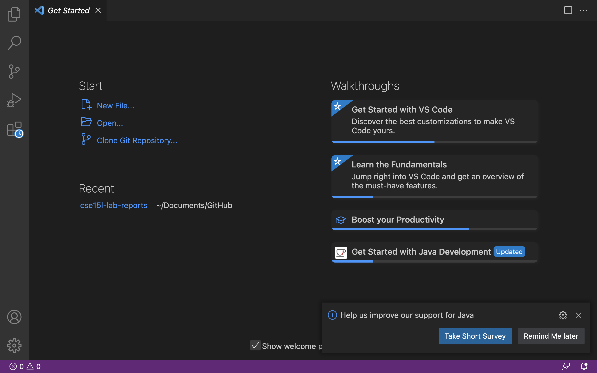
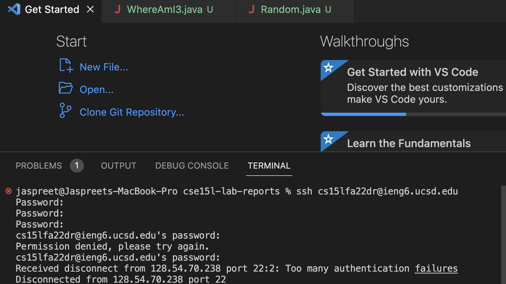
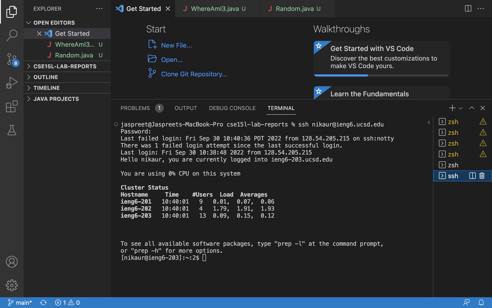
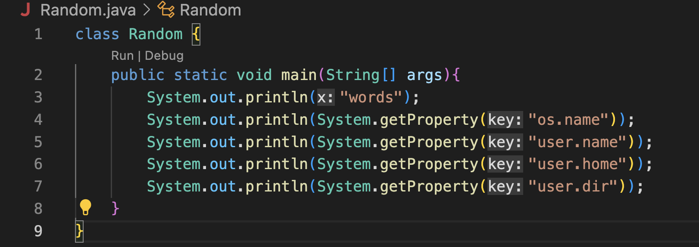
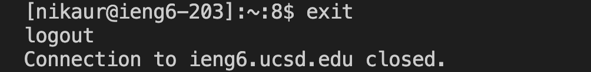
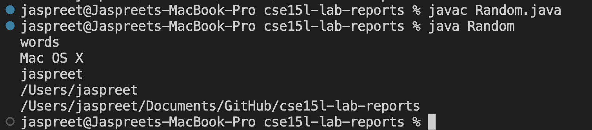
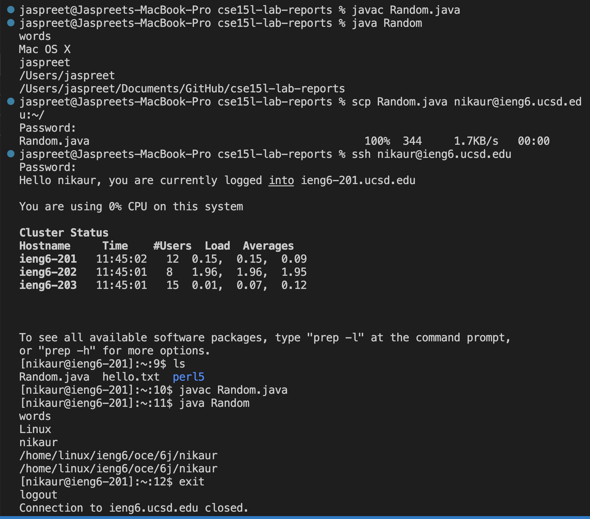
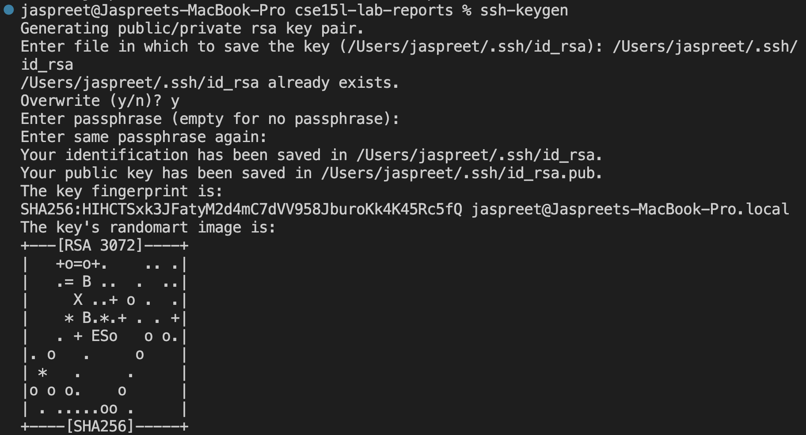
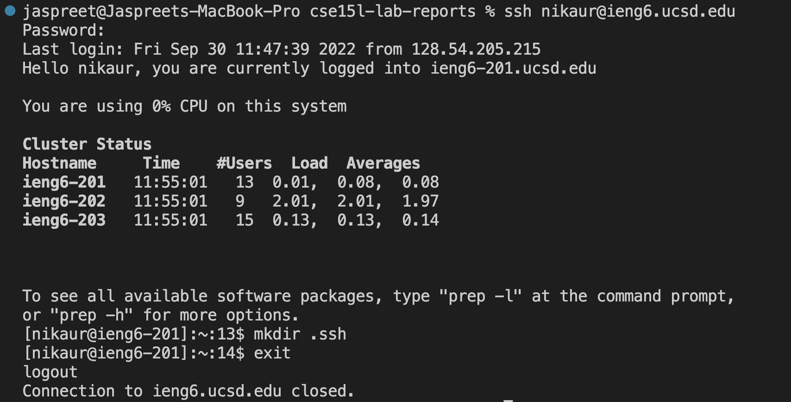
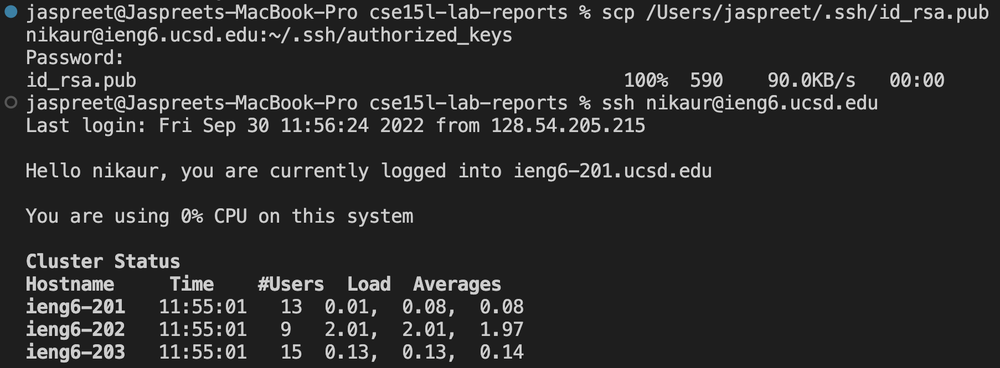

# Remote Access 
Hi CSE15L students!

The following post will cover how to log into a course-specific account on ieng6 for remote access for MacOS users, so let’s get started! 

1. **Find Your Account**

    Search for your course-specific account using the link below: 

    [Find Your Account](https://sdacs.ucsd.edu/~icc/index.php)

    Your username is your student email address (without the “@ucsd.edu”) and your Student ID is your PID. 

    

    Your course-specific account should be “cs15lfa22xx” where the xx are unique to your login information. Make sure to write this down and remember it. 

    Once you log in for the first time, you will need to reset your password. See the link below for additional instructions on how to reset your UCSD AD password. 

    [Password Reset](https://docs.google.com/document/d/1hs7CyQeh-MdUfM9uv99i8tqfneos6Y8bDU0uhn1wqho/edit)

    The password change will take 15-20 minutes to sync, so complete step 2 while waiting.

2. **Install Visual Studio Code**
    
    VSCode is the text editor we will be using. Since I already had VSCode, I did not need to install it, however, the link below provides instructions on how to install. 
    
    [Install VSCode](https://code.visualstudio.com/)

    Once it is installed, you should be able to open a window similar to the one below. 

    

3. **Connecting to a Remote Host**
	
    We’re going to start off by opening a terminal in VSCode.You can do this two ways: Shift + Control + ` OR at the top, go to Terminal and then click New Terminal. 

    The command should look like this where the xx is specific to your account:
    > $ ssh cs15lfa22xx@ieng6.ucsd.edu

    ***For me, the process of resetting the password and then trying to log in didn’t work after numerous troubleshooting attempts and using Piazza resources. I will be going into office hours either Friday or Monday to resolve this issue. The screen below is what I would get:***
    
    

    However, to continue with this lab I will be using my AD username (nikaur) to sign in. 

    I used the following command and entered my password: 
    > $ ssh nikaur@ieng6.ucsd.edu 

    For people logging in for the very first time, there will be a message about authenticity that asks “Are you sure you want to continue connecting (yes/no/[fingerprint])?”. Type in yes and press enter to continue. Then you will be able to enter your AD password, and the screen should look as follows: 

    

    Your computer is now connected to a computer in the CSE Basement! 
    ***Important terminology to note:*** your computer is referred to as the “client” and the computer in the basement is the “server”. 

4. **Running Some Commands**
    
    You can now try running some commands on your computer and the remote computer to see how this works (see below). To log out of the remote computer, either use Control + D, or type in the command “exit”. 
    * ls
    * ls -a
    * ls -lat
    * ls /home/linux/ieng6/cs15lfa22 
    * cat /home/linux/ieng6/cs15lfa22/public/hello.txt

5. **Moving Files using scp**

    To copy files from your computer to a remote computer, we will use the command “scp”. This command is always run from your computer (the client), not the server. To try this out, create a file called Random.java with the following code: 

    

    Logout of the remote computer if you haven’t already done so. 

    

    Compile and run the Random.java program: 

    

    Then, in the same terminal you complied and ran the program, use the following command: 
    
    >scp Random.java cs15lfa22xx@ieng6.ucsd.edu:~/

    It will ask you to log into your ieng6 account with the password. 

    Then, log into your ieng6 account again using ssh. Run the command “ls” and this time the file Random.java should be in the home directory. 
    Notice the differences in the output when the program is run on the remote computer versus your computer. 

    

6. **SSH Keys** 
    Logging on and having to type the password every time is too time-consuming, so to resolve this we will use ssh-keygen. This creates a public and private key file and we will copy the public key onto the server and the private key onto the client so we no longer need to use the password. 

    On your computer, run the following commands:\
        *for the passkey, just press enter\
        *in my case, I had to overwrite the already existing file since I used a ta account earlier during lab 
    
    

    To copy the public key onto the .ssh directory of your account on the server, log back in, run the following command, and logout. 

    

    On your computer, run the following command as it applies to your setup, and you should be able to use ssh and scp without a password! 

    

7. **Optimize Remote Running** 
    We want to be able to copy files over quickly, so try to make an edit to the local Random.java file (on your computer), copy it to the server, and then run it on the server.
    To do this we will take advantage of the the following shortcuts: 
    * Up-arrow on keyboard: to recall the previous command 
    * Semicolons: to run multiple commands on the same line in the terminal 
    * ssh + command in quotes: at the end of the ssh command to log in, type the command in quotes (ex: “ls”) to log in and run the command using one line on the terminal. 

    My process for this was to use the up arrow multiple times since I previously ran some of these commands and used the semicolon to compile the program Random.java. 

And that's a wrap. Thank you.

Credit: The authors of [*Week 1 - Remote Access and the Filesystem*](https://ucsd-cse15l-f22.github.io/week/week1/#week1-lab-report) on the [CSE 15L website](https://ucsd-cse15l-f22.github.io) for the process and general instructions. 