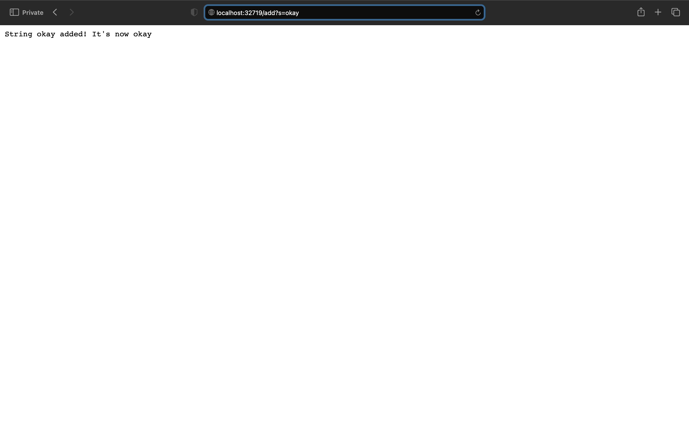
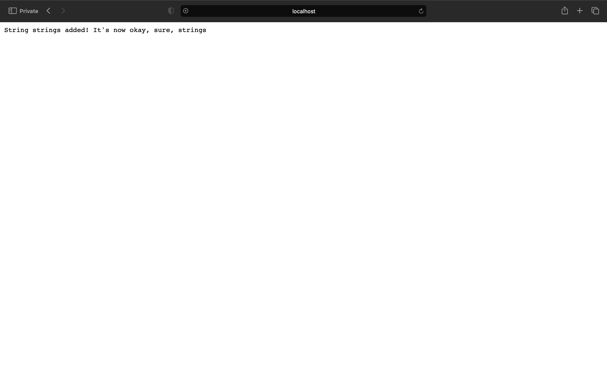

# Week 3 Lab Report 

## Part 1 -- Week 2 Lab 

***Code for the Simplest Search Engine:***
```
import java.io.IOException;
import java.net.URI;
import java.util.ArrayList;
//import java.util.List;
//import java.util.Arrays;

//printing an array 
class ArrayPrint{
    ArrayList<String> sr = new ArrayList<>();  
    ArrayPrint(ArrayList<String> sr){
        this.sr  = sr; 
        for(int i=0; i<sr.size(); i+=1){
            System.out.println(sr.get(i));
        }
    }
}

class Handler implements URLHandler {
    // The one bit of state on the server: a number that will be manipulated by
    // various requests.
    //ArrayList<String> str = new ArrayList<>(); 
    //ArrayList<String> con = new ArrayList<>(); 
    //ArrayList<String> sr = new ArrayList<>(); 
   
    //method to create String from ArrayList<String> 
    public String printString(ArrayList<String> sr){
        String r = String.join(", ", sr); 
        return r; 
    }
    ArrayList<String> str = new ArrayList<>();
    ArrayList<String> con = new ArrayList<>();
    
    public String handleRequest(URI url) {
        if (url.getPath().equals("/")) {
            return "String: ";
        }
        else {
            System.out.println("Path: " + url.getPath());
            
            if (url.getPath().contains("/add")) {
                String[] parameters = url.getQuery().split("=");
                str.add(parameters[1]);
                return "String " + parameters[1]+ " added! It's now " + printString(str) + "size = " 
                + str.size();       
            } 
            else if (url.getPath().contains("/search")){
                String[] parameters = url.getQuery().split("="); 
                for(int i=0; i<str.size(); i+=1){
                        if(str.get(i).contains(parameters[1])){
                            con.add(str.get(i)); 
                        }
                    }
                return "String " + parameters[1] + " found! In the following words " + printString(con); 
            }
        }
        return "404 Not Found!";
    }
}

class SearchEngine {
    public static void main(String[] args) throws IOException {
        if(args.length == 0){
            System.out.println("Missing port number! Try any number between 1024 to 49151");
            return;
        }

        int port = Integer.parseInt(args[0]);

        Server.start(port, new Handler());
    }
}
```

## Screenshots of Application

Preface: There will be 4 screenshots in the following, the first one won't have a lot of details while the following three will. 
 1. In the screenshot below I'm building and running a server on the local computer. 


2. In the screenshot below, I first added an instance of "okay" to the String ArrayList using the add method in my code ("/add?s=okay"). Once the code went through my argument, it filters through the argument to find the string I wanted to add, which in this case was "okay". This then updates the String ArrayList to contain "okay" and then prints out the whole string (which only contains okay at this point) on the screen. 

    
 
3. In the second screenshot, I already added an instance of "sure" (not shown) and then added an instance of "strings" to the String ArrayList using the add method in my code ("/add?s=strings") a third time. This was to make it that the String ArrayList is longer for when we use the search method later. Similar to the previous screenshot, the code goes through the argument, filters through to find the string I wanted to add ("strings"), and then updates the String ArrayList to contain "okay", "sure", and "strings". This updated list is then printed out onto the screen, showing the statement "String strings added! It's now okay, sure, strings". 



4. In the third screenshot, I this time tried to search for strings in the String ArrayList that contain the string "s". This was done using the search method in my code ("/search?s=s"). Here, the code goes through the argument and filters through the command to find the string that I want to look for in the list. It then goes through each String index in the list and, using another String Arraylist, only adds the strings in the original list that contain the inputted string. Once the code checks all indices, it prints out the new String Arraylist containing the specific string onto the screen. In our case, the original list had the strings "okay", "sure", and "strings", so when we looked for the string "s" in the list, only two strings, "sure" and "strings", were returned since they contained the string "s".  


## Part 2 -- Week 3 

***ArrayTests.java file***
 
Failure-Inducing Input: 
Upon testing the reverseInPlace method, the following bug was discovered and improved upon. 
```
@Test
 public void testReverseLargerArrays(){
   int[] input1 = {1, 2, 3};
   ArrayExamples.reverseInPlace(input1);
   assertArrayEquals(new int[]{3, 2, 1}, input1);
 }
 ```

Symptom: 
```
There was 1 failure:
1) testReverseLargerArrays(ArrayTests)
arrays first differed at element [2]; expected:<1> but was:<3>
        at org.junit.internal.ComparisonCriteria.arrayEquals(ComparisonCriteria.java:78)
        at org.junit.internal.ComparisonCriteria.arrayEquals(ComparisonCriteria.java:28)
        at org.junit.Assert.internalArrayEquals(Assert.java:534)
        at org.junit.Assert.assertArrayEquals(Assert.java:418)
        at org.junit.Assert.assertArrayEquals(Assert.java:429)
        at ArrayTests.testReverseLargerArrays(ArrayTests.java:23)
        ... 32 trimmed
Caused by: java.lang.AssertionError: expected:<1> but was:<3>
        at org.junit.Assert.fail(Assert.java:89)
        at org.junit.Assert.failNotEquals(Assert.java:835)
        at org.junit.Assert.assertEquals(Assert.java:120)
        at org.junit.Assert.assertEquals(Assert.java:146)
        at org.junit.internal.ExactComparisonCriteria.assertElementsEqual(ExactComparisonCriteria.java:8)
        at org.junit.internal.ComparisonCriteria.arrayEquals(ComparisonCriteria.java:76)
        ... 38 more
```

Essentially, the expected reversed list was {1, 2, 3}, but what we were getting instead was {3, 2, 3} 

Bug + Connection: \
Looking at the code, the original implementation was changing/altering the original ArrayList using a for loop so by the time the first index got altered to equal the last index, the original first index value wasn't stored anywhere, hence the last value being 3 again. To fix this issue, the code needs to be altered so that there is a copy of the original ArrayList and that copy of the original ArrayList can be used to update and then return the actual ArrayList. Upon making this correction in lab, the input produced the expected output (yay, success). 


***LinkedList.java file***

Failure-Inducing Input: 
Upon testing the merge method, the following bug was discovered and improved upon. 
```
@Test
    public void mergeTest(){
        List<String> input = Arrays.asList("hi", "hello", "k", "hm");
        List<String> input2 = Arrays.asList("boy", "apple"); 
        ListExamples.merge(input, input2);
        List<String> comp = Arrays.asList("apple", "boy", "hello", "hi", "hm", "k"); 
        assertEquals(comp, ListExamples.merge(input, input2)); 
    }
```

Symptom: 
```
There was 1 failure:
1) mergeTest(ListTests)
java.lang.AssertionError: expected:<[apple, boy, hello, hi, hm, k]> but was:<[boy, apple, hi, hello, k, hm]>
        at org.junit.Assert.fail(Assert.java:89)
        at org.junit.Assert.failNotEquals(Assert.java:835)
        at org.junit.Assert.assertEquals(Assert.java:120)
        at org.junit.Assert.assertEquals(Assert.java:146)
        at ListTests.mergeTest(ListTests.java:32)

FAILURES!!!
Tests run: 1,  Failures: 1
```

Essentially, the expected merged list was supposed to take the two lists, and combine them in alphabetical order thus the expected was {apple, boy, hello, hi, hm, k}. However, the merge method instead only combined the two lists and didn't alphabetize them making the actual output {boy, apple, hi, hello, k, hm}. 

Bug + Connection: \
Looking at the code, the original implementation was only merging the two lists but not alphabetizing them. To make it so that both lists combined were alphabetized, the code needs to add that alphabetization part to the end of the current implementation. I did this by importing the java.util package and using the sorted method to alphabetize which worked on the current test/input (yay another success). \
The sorted() method was implemented as described by the following website: [sorted() method](https://www.javatpoint.com/how-to-sort-a-list-in-java). 