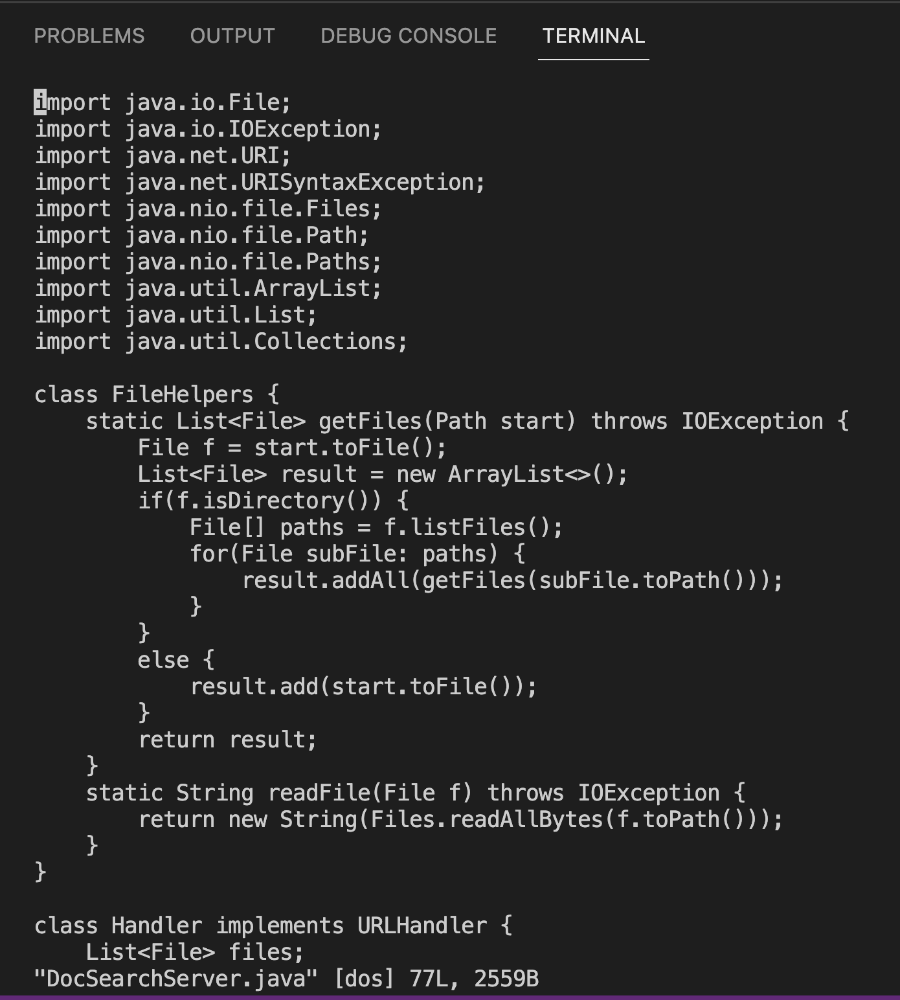
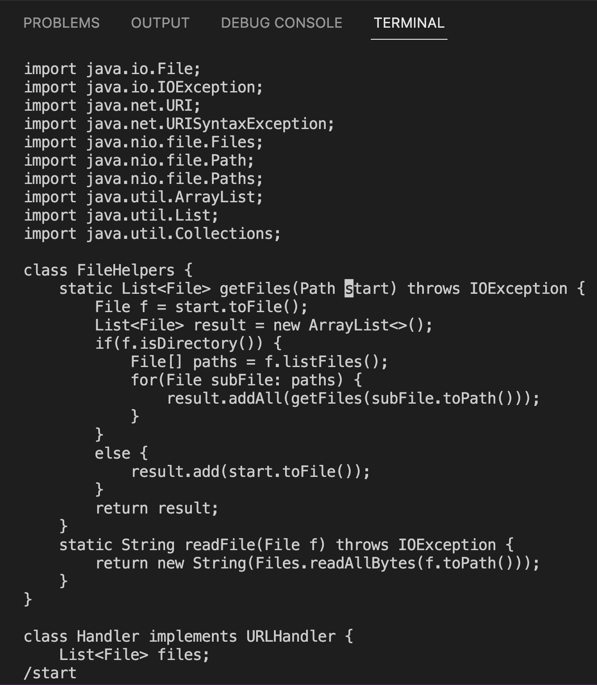
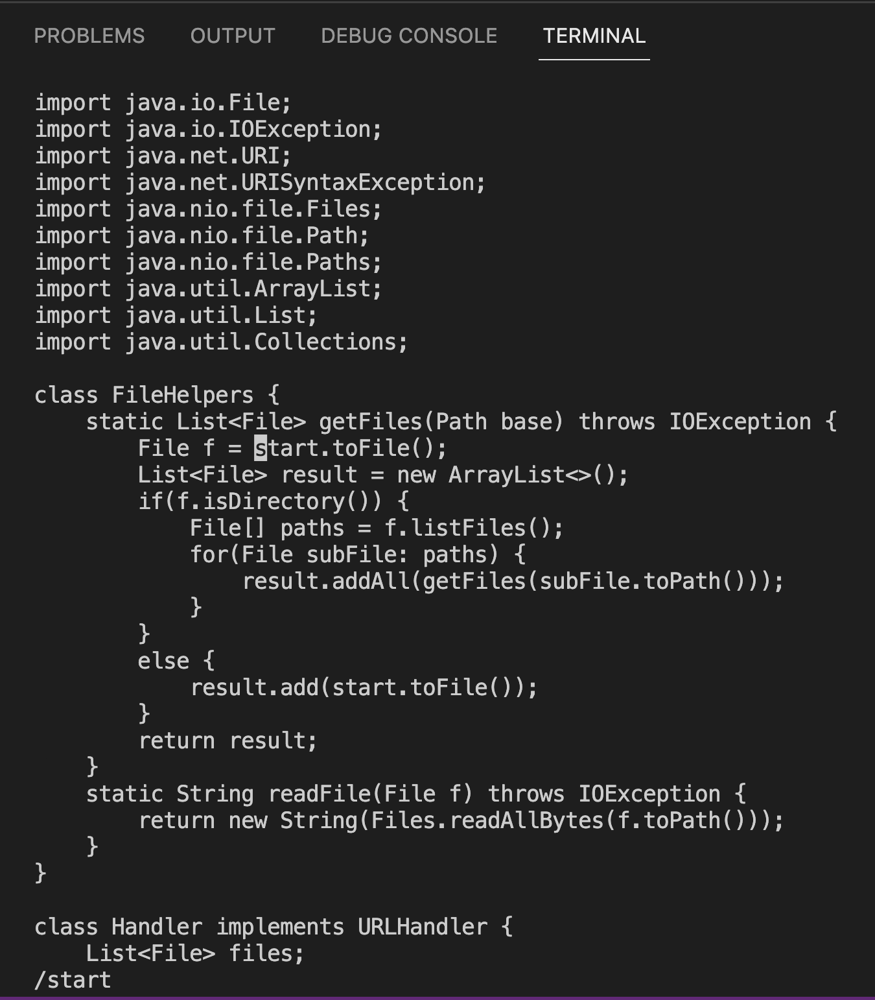
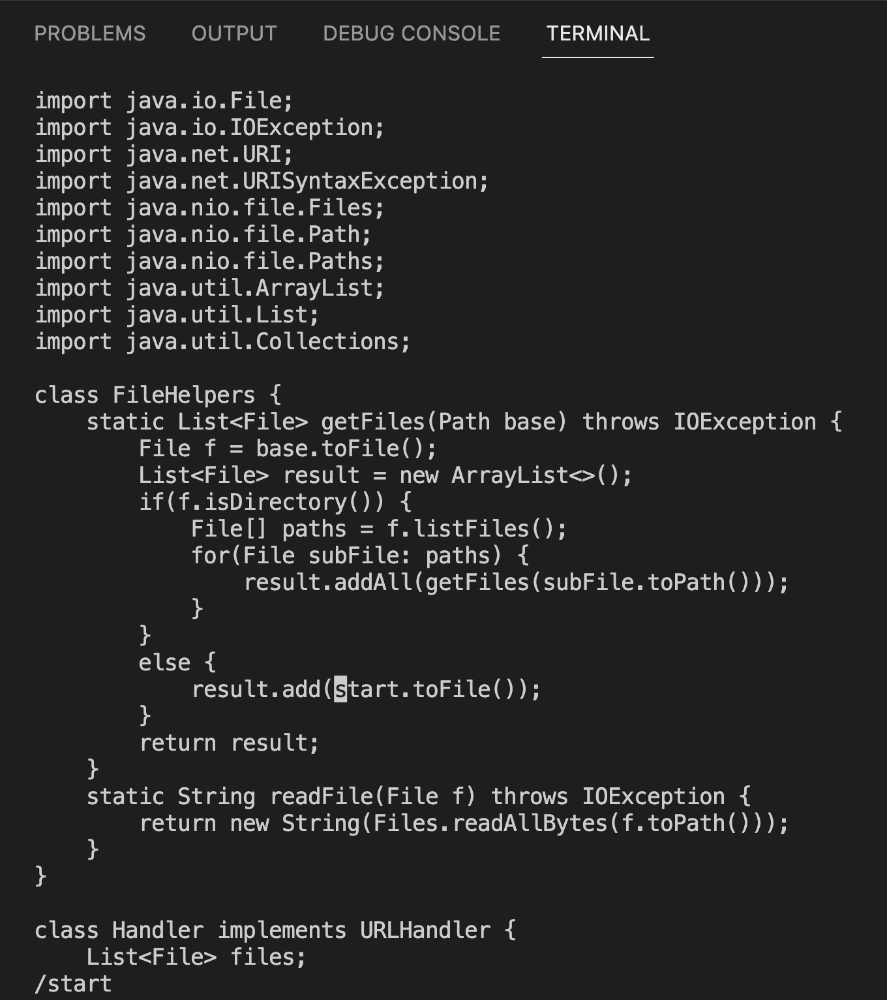
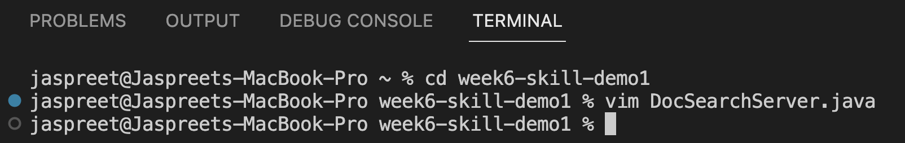

# Week 7 Lab Report 

## **Part I**

***Vim Task:*** *In DocSearchServer.java, change the name of the start parameter of getFiles, and all of its uses, to instead be called base.*

**Sequence of vim commands to accomplish this task:**
```
vim D<Tab><Enter> 
```


Here, the DocSearchServer.java file is opened and the cursor is at the start of the file (where it says import)

```
/start<Enter>
```


This command makes it so that the cursor moves to the first instance of the word "start" and now we can delete the word and replace it with "base" 

```
ce
base<Esc> 
n
```


The "n" command shifts the cursor to the next instance of the word "start" so we can delete and replace the next instance. 

```
ce
base<Esc> 
n
```


Again, the "n" command shifts the cursor to the next instance of the word "start" so we can delete and replace the next (and in this case, last) instance. 

```
ce
base<Esc> 
:wq
```


This command saves the edits that we made and exits vim. 

## **Part II**
Time to perform the task starting in VSCode: 1 minute 55 seconds 

Time to perform the task starting in the remote server: 33 seconds 

1) Which of these two styles would you prefer using if you had to work on a program that you were running remotely, and why? 

I would prefer to work on the remote server if I were running the program remotely because then I don't have to scp the necessary files and I'm logged into the remote server to begin with. 

2) What about the project or task might factor into your decision one way or another? (If nothing would affect your decision, say so and why!)

I think it really depends on whether or not I need to run something remotely or not. Not having to scp file(s) would be the easier/faster process, so if I'm running remotely I'd want to start in the remote server, but if I'm running locally, I'd want to start local. 