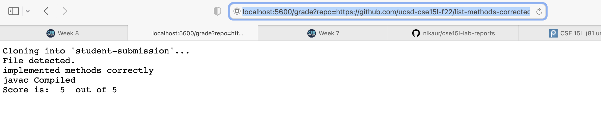
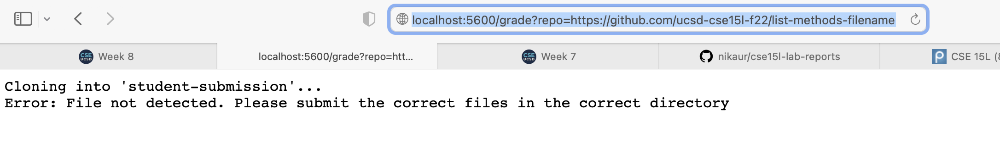
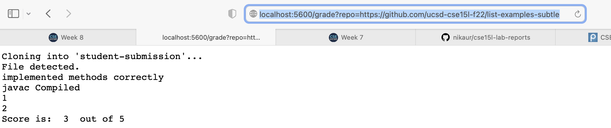

# Week 8 Lab Report 


## **grade.sh code**

```
# Create your grading script here

rm -rf student-submission
git clone $1 student-submission

#useful variables 
CP=".:lib/hamcrest-core-1.3.jar:lib/junit-4.13.2.jar"

#copy over our written tests to the student-submission directory 
cp TestListExamples.java student-submission
cp -r lib student-submission
#go into the student-submission directory 
cd student-submission 


#check if ListExamples.java is a file 
if [[ -f ListExamples.java ]]
then 
    echo "File detected."
else 
    echo "Error: File not detected. Please submit the correct files in the correct directory"
    exit 1 
fi 


#check if javac is working 
javac -cp $CP *.java 

#if after javac there is any error message, 
    #that means that the methods were not written correctly 
if ! [[ $? -eq 0 ]]
then 
    echo "method implementation error"
    exit 1
else 
    echo "implemented methods correctly"
fi


if [[ -f ListExamples.class ]]
then #it's working 
    echo "javac Compiled"
else #javac is not working
    echo "Compile error"
    exit 1 
fi 


java -cp $CP org.junit.runner.JUnitCore TestListExamples > testanswers.txt 

# grep for all the tests --- then find how many failed to find the score 
# start from full score + deduct by 1 for every failed test 


declare -i a=5

output1=$(grep "mergeTest(*" testanswers.txt)
if [[ ! -z "$output1" ]] 
then 
    let "a=a-1"
    echo 1
fi

output2=$(grep "mergeTestLong*" testanswers.txt)
if [[ ! -z "$output2" ]] 
then 
    let "a=a-1"
    echo 2
fi

output3=$(grep "mergeTestEmpty*" testanswers.txt)
if [[ ! -z "$output3" ]] 
then 
    let "a=a-1"
    echo 3
fi

output4=$(grep "filterTest(*" testanswers.txt)
if [[ ! -z "$output4" ]] 
then 
    let "a=a-1"
    echo 4
fi

output5=$(grep "filterTestAgain*" testanswers.txt)
if [[ ! -z "$output5" ]] 
then 
    let "a=a-1"
fi

echo "Score is: " $a " out of 5"
```

## **Student Submission Examples**

*Note -- the following student submissions were run locally because I'm not on campus*

**Student Submission 1: https://github.com/ucsd-cse15l-f22/list-methods-corrected**



**Student Submission 2: https://github.com/ucsd-cse15l-f22/list-methods-filename**



**Student Submission 3: https://github.com/ucsd-cse15l-f22/list-examples-subtle**



## **grade.sh Trace**

**Using Student Submission 2: https://github.com/ucsd-cse15l-f22/list-methods-filename**

The code starts on line 3 of grade.sh 

Lines with comments or that are empty will be ignored. 

3: 
```
rm -rf student-submission 
```
is a command that removes the student-submission folder that was created when grade.sh was previously run on another student submission if that folder exists. The standard output would be all the files that are being deleted or removed from that folder (including the folder)
- return code: 0

4: 
```
git clone $1 student-submission
```
is a command that takes the parameneter of the student-submission repository from the terminal and clones it into the folder student submission 
- standard output: none
- standard error: "Cloning into 'student-submission'..."
- return code: 0  

7: 
```
CP=".:lib/hamcrest-core-1.3.jar:lib/junit-4.13.2.jar"
```
This is not a command, but rather a variable that will be later used. 

10: 
```
cp TestListExamples.java student-submission
```
is a command that copies over TestListExamples.java into the student-submission folder so we can use that java file. 
- standard output: none
- standard error: none
- return code: 0 

11:
```
cp -r lib student-submission
```
is a command that also helps with making sure that our written tests are correctly copied into the student-submission folder. 
- standard output: none
- standard error: none
- return code: 0 

13:
```
cd student-submission 
```
is a command for us to go into the student-submission directory 
- standard output: none
- standard error: none
- return code: 0 

17:
```
if [[ -f ListExamples.java ]]
```
this is an if statement that checks if the file ListExamples.java exists in student-submission. For this student submission the answer to the if statement is false. 

18: 
```
then 
```
this will not run because the if statement is false. 

19: 
```
    echo "File detected."
```
this also will not run because the if statement is false. 

20: 
```
else 
```
because the if statement is false we go to the else commands 

21: 
```
    echo "Error: File not detected. Please submit the correct files in the correct directory"
```
This statement lets the student know that the ListExamples.java file was not present in as named in their submission. 

22: 
```
    exit 1 
```
This has us terminate the bash script with an exit code of 1 since the file we need is not there. 